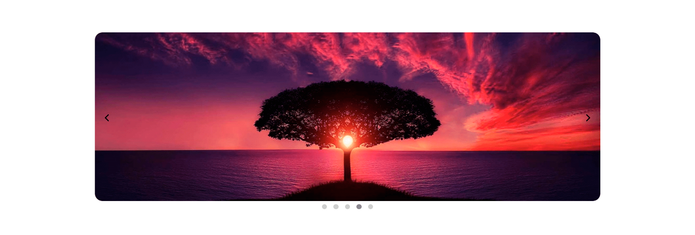

# 👆 Свайп галерея на чистом JS

🖼️[Демо](https://krnvst.github.io/gallery-swipe/)

### Реализовано:

- [x] Свайп мышкой вправо\влево для смены слайда
- [x] Переход с помощью стрелок
- [x] Переход с помощью точек
- [x] Возможность менять скорость анимации перехода
- [x] Возможность отображать\скрывать точки под слайдером
- [x] Возможность задать отступ между слайдами
- [x] Мобильная версия + мобильный свайп